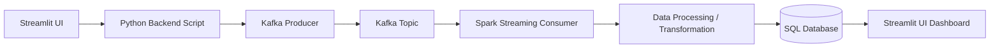
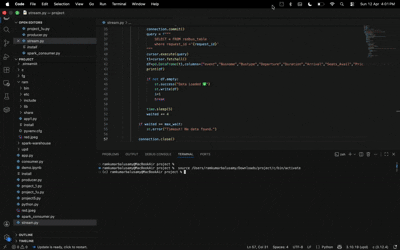

# Project Title
**Bus Choice Optimizer using Selenium and Streamlit**

# Project Overview
     This project is about to collect the datas of Bus as per customer specific Destination.With Webscraping tool Selenium I choosen Redbus website to collect Bus infos like Travelsname, Bustype, Travel Duration,etc,...
     Scrpped Data of Buses are structured into proper format which makes the data to sort by price and filter the best of customers choice for travelling.
     its helps to find the best options among multiple messy bus options of best rated and Affortable price travelling
# Architecture
   ## System Architecture


# Tech Stack
   * Python 3.8+
   * Pandas
   * Pymysql
   * Streamlit

# Project Structure
## 📁 Project Structure

```
project-root/
│
├── stream.py
├── scrapper.py
├── producer.py
└── spark_consumer.py
```
# How To Run The Project

 **STEP-1**
 ```bash
     brew install openjdk
```
**STEP-2**
 ```bash
    curl -L https://archive.apache.org/dist/kafka/3.6.1/kafka_2.13-3.6.1.tgz -o kafka.tgz
```
 **STEP-3**
 ```bash
    tar kafka.tgz
    cd kafka_2.13-3.6.1
```
 **STEP-4**
 ```bash
    bin/kafka-storage.sh random-uuid
```
 **STEP-5**
 ```bash
    bin/kafka-storage.sh format \
  -t random-uuid\
  -c config/kraft/server.properties
```
**STEP-6**
 ```bash
   bin/kafka-server-start.sh config/kraft/server.properties
```
 **STEP-7**
 ```bash
     python -m venv upd
     source upd/bin/activate
  ```
**STEP-8**
```bash 
     git clone https://github.com/Ramk4222/Bus Choice Optimizer.git
     cd Bus Choice Optimizer
 ``` 

 **STEP-9**
  ```bash
     pip install -r requirements.txt
  ```
**STEP-10**

```bash
   python stream.py
```
```bash
   # to Run Streamlit
   Streamlit Run stream.py
```


# Before Run Check
```text
   Check Kafka Kraft is Running
   Ensure All Required Libraries are Installed
```
# Project Goal
```text
   This Project is about to deliver Real-Time data for users to Enable wide options with their Customize filters. Future developement is to Scrap data of multiple platforms to view in a Single page with add-on of discounts and sales on the date of travelling.
```
# Done By

Ramkumar Balusamy

## 🎥 Demo Preview



    
     

    
 
      

   
